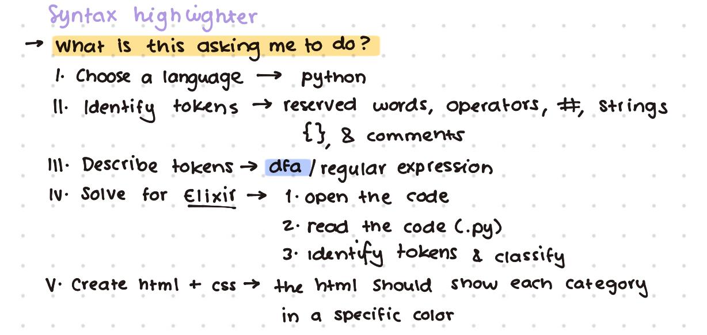
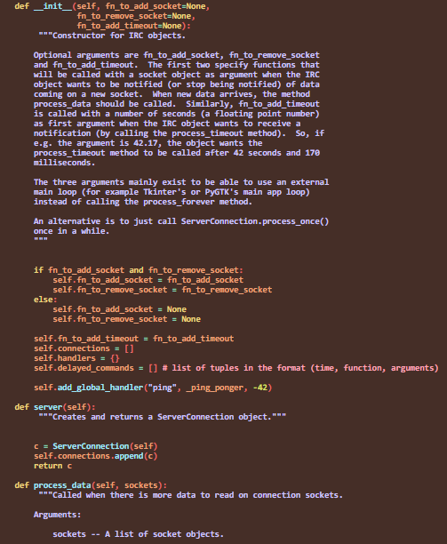
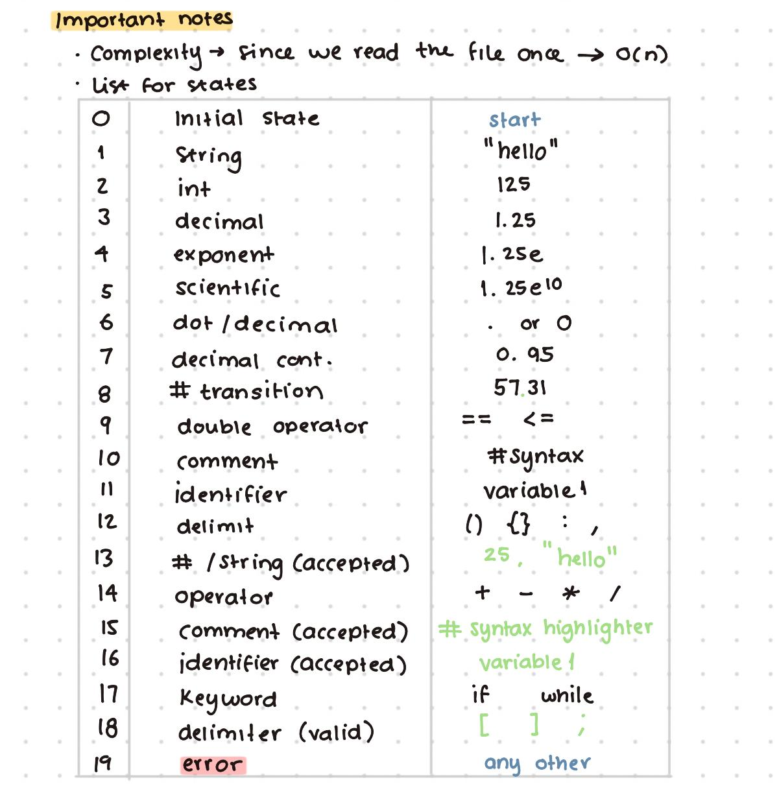

  
# E2 Syntax highlighter: Parallel

TC2037  
Group 601

Paulina Cortez Balvanera | A01782041

Professor: Gilberto Echeverría

June 11, 2026  
**Analysis**  
**I. Objective**  
The finality of this project implies the process of implementing a code that can highlight the python programs through a code done in Elixir. For this exercise, a DFA was made in order to determine the different tokens that the python language contains in order to finalize the progress that can show a .html web-page with a .css that can visually show the differences between each one of the elements

**II. Process Followed**  

**III. How to run the code (Parallel Edition)**  
The following folder contains various files, yet we will only require: 

- The elixir code: python\_highlighter.ex  
- A folder with various large python codes that will help try the highlighter: [python_files](https://github.com/pousinnn/Software-Construction/tree/main/FourthSemester/TC2037_ICM/Highlighter/python_files)  
- Two HTML codes: To show visually the highlighter we will have display.html and for the final highlighter we will use resultado.html. This last one will be updated when we run the code  
- CSS code: The color selection that was used for the highlighter: styles.css  

Now that we have all the files identified, we should download the whole folder, after completing this process, we should move into the ubuntu-terminal. When we are placed in the correct folder inside the terminal, we should add the command:   
- iex python\_highlighter.ex

With this, we will open the Elixir interactive shell and start with the command: 

- PythonHighlighter.run("python_files/", "output/")

The output of this command will regenerate the output folder that is already on the repository. At the same time it will display the text "All files processed" and show the time it took the program to display those files

When updated, select it and feel free to open it in the browser of your choice. It should display something similar to this:

**IV. Analysis**
As mentioned, i decided to work with a DFA that read the code using a matrix table, through that system it was possible to classify the python code into a category and determoine the type of token being processed. And when all those tokens where processed, they were able to convert into an html file that displayed them in colors corresponding to their category. Adding the fact that this final review had the intention to be able to work in various files at the same time.

This files was worked with not only the lexical analysis through the dfa but also through recursion and parallel processing; each file was processed line by line, character by character and worked asynchronous though the function of task.await

In this case, we were working with parallelism, so the various files could be read at the same time - meaning that we are simultaneously processing different files. So we are using highlight_parallel to make it work independently. And even though the individual file processing is still O(n) (n representing the amount of characters), the time of reading the file will change and make it increase accoring to the maximum amount of files.

**V. DFA**

**VI. Relevant sources**  
- [python](https://www.w3schools.com/python/python_ref_keywords.asp) 
- [display html](https://stackoverflow.com/questions/39722225/how-to-display-text-in-a-span-tag-based-on-the-value-of-input-field)
- [Understanding timer](https://www.yellowduck.be/posts/logging-execution-time-in-elixir)
- [Substrings](https://www.yellowduck.be/posts/pattern-matching-on-strings-in-elixir)
- [Reading a folder](https://elixir.hexdocs.pm/Path.html)
- [Mkdir](https://elixir.hexdocs.pm/1.14.5/File.html)
- [Mkdir](https://stackoverflow.com/questions/53877076/elixir-write-to-a-file-and-create-parent-directories-if-they-dont-exist-in-o)
- Gilberto's Classes
- Victor's Classes

**VII. Ethical Reflection**

I think that throughout this project, I was able to see how software tools can make programming tasks more efficient and accessible. Syntax highlighters are often taken for granted, but they play an relevant role in helping people understand code, see mistakes, and improve productivity. 

At the same time, this project made me reflect on the broader impact of automation in computing. Technologies that automate repetitive tasks can significantly improve efficiency and allow people to focus on more complex and creative aspects of their work. However, there is also a risk that users become overly dependent on automated tools and stop developing a deep understanding of the underlying concepts. For example, a syntax highlighter can help identify errors visually, but it cannot replace a programmer's understanding of programming logic and problem solving. Another important ethical consideration is the responsibility developers have when creating software tools. Even relatively simple applications can influence how people work and make decisions. Developers should strive to create tools that are reliable, transparent, and beneficial to users. 

The use of parallel processing in this project also highlights how modern technology seeks to maximize efficiency by making better use of available computing resources. While this can lead to faster and more powerful applications, it also reminds us that technological advancements should be designed with sustainability and responsible resource usage in mind. As software systems continue to grow in complexity, developers must balance performance improvements. Overall, this project reinforced the idea that technology is not only about solving technical problems but also about creating tools that positively support the people who use them. As future software engineers, it is important to think beyond functionality and performance and consider how our work affects users, organizations, and society as a whole.