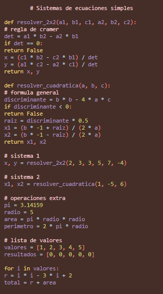

  
![Tecnológico de Monterrey: pionero en aprendizaje y bienestar remotos][image1]

Campus Santa Fe

E1 Syntax highlighter

TC2037  
Group 601

Paulina Cortez Balvanera | A01782041

Professor: 

May 17, 2026  
**Analysis**  
**I. Objective**  
The finality of this project implies the process of implementing a code that can highlight the python programs through a code done in Elixir. For this exercise, a DFA was made in order to determine the different tokens that the python language contains in order to finalize the progress that can show a .html web-page with a .css that can visually show the differences between each one of the elements

**II. Process Followed**  

**III. How to run the code**  
The following folder contains 6 important files: 

- The elixir code: python\_highlighter  
- Two python codes that will help try the highlighter: [intento.py](http://intento.py) and [prueba.py](http://prueba.py)  
- Two HTML codes: To show visually the highlighter we will have display.html and for the final highlighter we will use resultado.html. This last one will be updated when we run the code  
- CSS code: The color selection that was used for the highlighter: styles.css  
- Lastly

Now that we have all the files identified, we should download the whole folder, after completing this process, we should move into the ubuntu-terminal. When we are placed in the correct folder inside the terminal, we should add the command:   
- iex python\_highlighter.ex

Inside this command, we will open either one of the python codes that will help us show the highlighter:  
- PythonHighlighter.lexer\_categorias("[prueba.py](http://prueba.py)")  
- PythonHighlighter.lexer\_categorias("[intento.py](http://intento.py)")

When this process is concluded, the file “resultado.html” will be updated. When updated, select it and feel free to open it in the browser of your choice. It should display something similar to this:

**IV. DFA**

**IV. Relevant sources**  
Paginas para entender python:  
[https://www.w3schools.com/python/python\_ref\_keywords.asp](https://www.w3schools.com/python/python_ref_keywords.asp)

**V. Ethical Reflection**
I think that this project allowed me to understand that programming simple tools is more complex than I would've thought. The whole project felt quite overwhelming due to the need to understand how the different tokens work and how they impact the language as a whole. But at the end it makes sense how their existance makes programming more friendly, since this made me think a lot about how  much we don't think the programming langauges in more technical terms and we just take them for granted. 
For a future work, I am aware that this project may have its limitations due to my personal knowledge about python, elixir and their limitations. But at the same time, I know that with a proper learning about standard python and more efficent ways to work with elixir this could grow a lot. I am thankful for the opportunity to understand how this type of systems are able to work, even if it's in a smaller scale. 